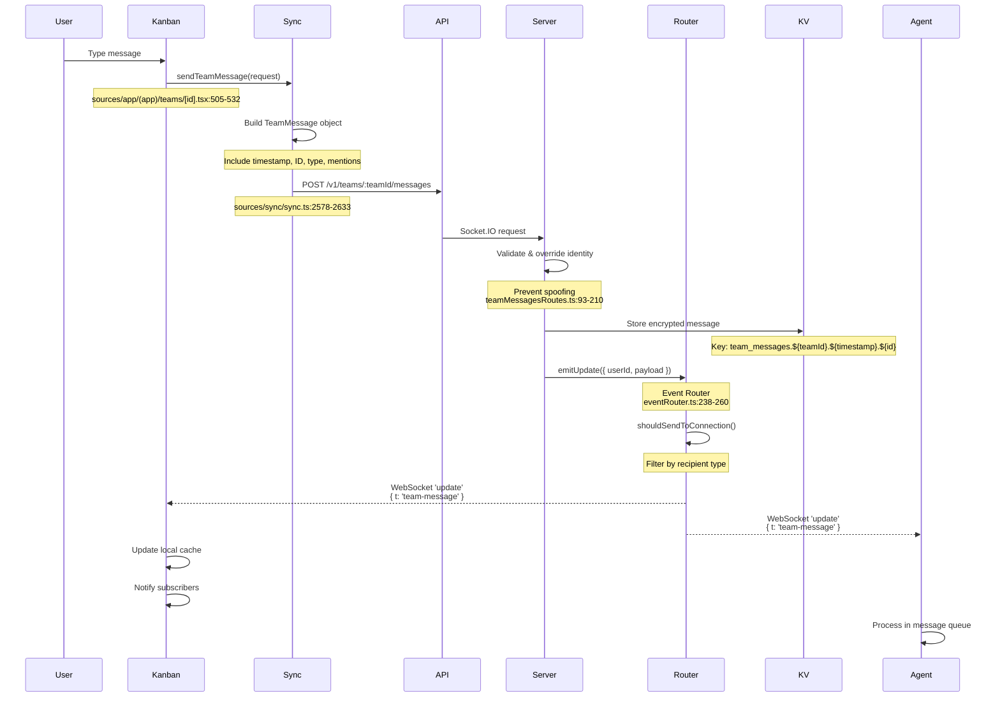
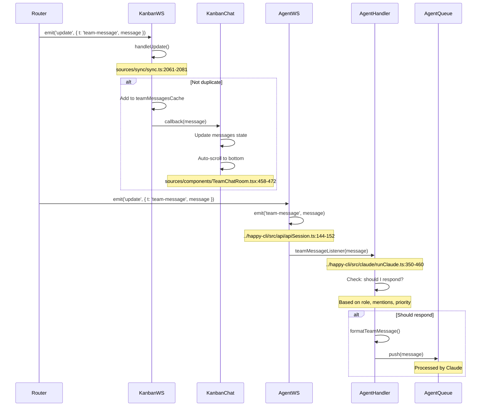
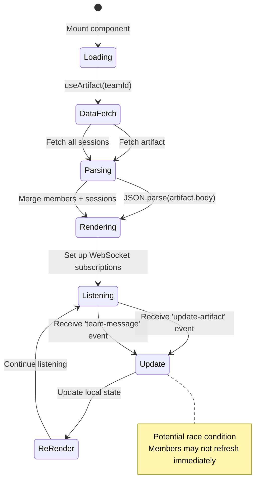
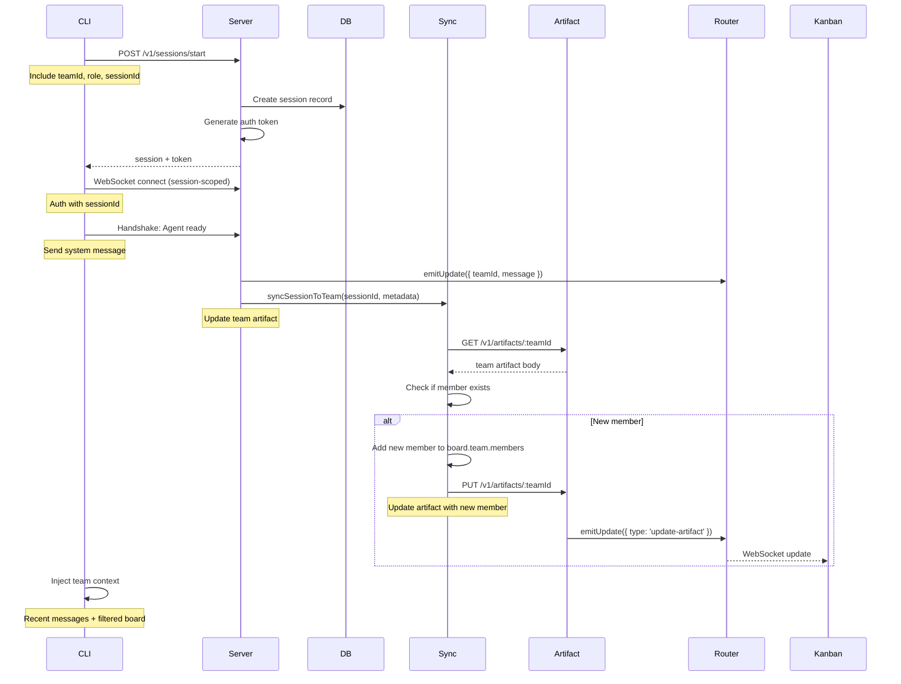
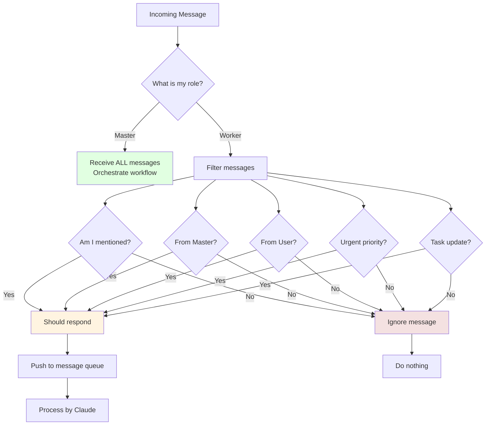
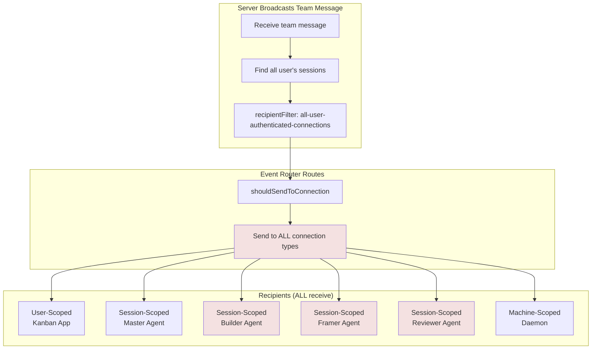
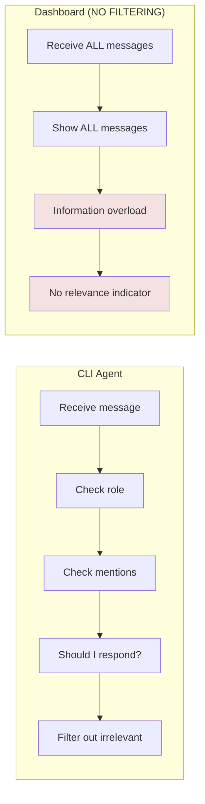
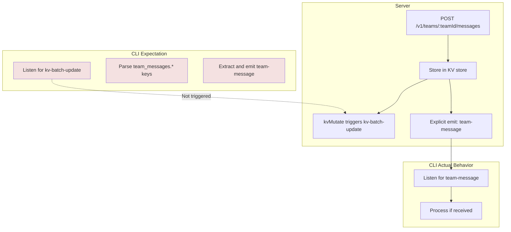
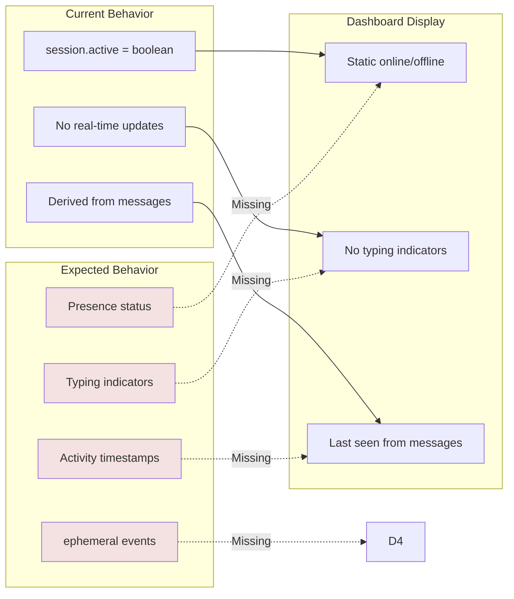

# Team Messaging & Multi-Agent Architecture Analysis

## Table of Contents
1. [High-Level Architecture](#high-level-architecture)
2. [Team Message Flow](#team-message-flow)
3. [Dashboard Data Flow](#dashboard-data-flow)
4. [Multi-Agent Communication](#multi-agent-communication)
5. [Critical Gaps](#critical-gaps)
6. [Recommendations](#recommendations)

---

## High-Level Architecture

```mermaid
graph TB
    subgraph "User Layer"
        KANBAN[Kanban Dashboard<br/>sources/app/(app)/teams/[id].tsx]
    end

    subgraph "Server Layer"
        SERVER[Happy Server<br/>../happy-server]
        ROUTER[Event Router<br/>eventRouter.ts:238-260]
        KV[KV Store<br/>Encrypted Messages]
    end

    subgraph "Agent Layer"
        CLI[Happy CLI Agents<br/>../happy-cli]
        MASTER[Master Agent<br/>Orchestrator]
        BUILDER[Builder Agent<br/>Implementation]
        FRAMER[Framer Agent<br/>Architecture]
        REVIEWER[Reviewer Agent<br/>Quality]
    end
    
    subgraph "Shared Layer"
        CONFIG[Shared Team Config<br/>@happy/shared-team-config]
    end
    
    KANBAN <-->|WebSocket /v1/updates<br/>User-Scoped| SERVER
    KANBAN <-->|HTTP POST<br/>/v1/teams/:teamId/messages| SERVER
    
    CLI <-->|WebSocket /v1/updates<br/>Session-Scoped| SERVER
    SERVER --> ROUTER
    ROUTER <--> KANBAN
    ROUTER <--> CLI
    ROUTER <--> MASTER
    ROUTER <--> BUILDER
    ROUTER <--> FRAMER
    ROUTER <--> REVIEWER
    
    SERVER -->|Read/Write<br/>team_messages.*| KV
    
    KANBAN -.->|Import| CONFIG
    CLI -.->|Import| CONFIG
    MASTER -.->|Import| CONFIG
    
    style KANBAN fill:#e1f5ff
    style SERVER fill:#ffe1e1
    style ROUTER fill:#fff4e1
    style CLI fill:#e1ffe1
    style CONFIG fill:#f4e1ff
```

---

## Team Message Flow

### Sending a Message



### Receiving Messages



---

## Dashboard Data Flow

### Kanban Board Data Sources

```mermaid
graph LR
    subgraph "Dashboard Component"
        DASH[Team Dashboard<br/>sources/app/(app)/teams/[id].tsx]
    end
    
    subgraph "Data Sources"
        ARTIFACT[Artifact Body<br/>JSON.parse(artifact.body)]
        SESSIONS[Artifact Sessions<br/>artifact.sessions]
        DESKTOP[Desktop Bridge<br/>useDesktopBridge]
    end
    
    subgraph "Derived Data"
        KANBAN[Kanban Board<br/>tasks, columns, team]
        ROSTER[Team Roster<br/>members with roles]
        ACTIVE[Active Members<br/>session.active = true]
    end
    
    subgraph "Hooks & Effects"
        USE_ARTIFACT[useArtifact teamId]
        USE_SESSIONS[useAllSessions]
        USE_DESKTOP[useDesktopBridge]
    end
    
    ARTIFACT --> USE_ARTIFACT
    SESSIONS --> USE_ARTIFACT
    DESKTOP --> USE_DESKTOP
    
    USE_ARTIFACT --> KANBAN
    USE_SESSIONS --> ROSTER
    USE_DESKTOP --> DASH
    
    KANBAN --> DASH
    ROSTER --> DASH
    ACTIVE --> DASH
    
    style DASH fill:#e1f5ff
    style KANBAN fill:#ffe1e1
    style ROSTER fill:#e1ffe1
```

### Dashboard State Updates



---

## Multi-Agent Communication

### Agent Registration Flow



### Agent Response Logic



---

## Critical Gaps

### Gap 1: Missing Real-Time Member Synchronization

```mermaid
graph LR
    subgraph "CLI Agent Joins"
        A1[Agent starts session]
        A2[Send handshake message]
        A3[syncSessionToTeam called]
    end
    
    subgraph "Server"
        B1[Update artifact body]
        B2[Emit update-artifact event]
    end
    
    subgraph "Dashboard (BROKEN)"
        C1[Receive update-artifact]
        C2[Update artifact.sessions]
        C3[Roster not recalculated]
        C4[Member not visible]
    end
    
    A1 --> A2
    A2 --> A3
    A3 --> B1
    B1 --> B2
    B2 --> C1
    
    C1 -.->|Race condition| C2
    C2 -.->|Misses update| C3
    C3 --> C4
    
    style C3 fill:#f4e1e1
    style C4 fill:#f4e1e1
```



**Root Cause:** `useArtifact(teamId)` hook doesn't react to `artifact.body` changes in the roster useMemo.

**File:** `/Users/swmt/happy/kanban/sources/app/(app)/teams/[id].tsx:405-440`

### Gap 2: WebSocket Connection Type Confusion



**Problem:** Workers receive ALL messages, including irrelevant ones.

**File:** `/Users/swmt/happy/happy-server/sources/app/events/eventRouter.ts:309-335`

### Gap 3: No Role-Based Message Filtering in Dashboard



**File:** `/Users/swmt/happy/kanban/sources/components/TeamChatRoom.tsx:579-597`

### Gap 4: Missing KV Store Event Consistency



**Problem:** CLI expects `kv-batch-update` events but server sends explicit `team-message` events.

**Files:** 
- Server: `/Users/swmt/happy/happy-server/sources/app/api/routes/teamMessagesRoutes.ts:150-163`
- CLI: `/Users/swmt/happy/happy-cli/src/api/apiSession.ts:138-151`

### Gap 5: Missing Team Member Presence Tracking



**File:** `/Users/swmt/happy/kanban/sources/components/TeamChatRoom.tsx:332-344`

---

## Recommendations

### High Priority Fixes

#### 1. Fix Real-Time Member Sync

**File:** `/Users/swmt/happy/kanban/sources/app/(app)/teams/[id].tsx:405-440`

```typescript
// BEFORE (current)
const roster = React.useMemo(() => {
    const members = kanbanData.team?.members ?? [];
    const allSessionIds = Array.from(new Set([
        ...(artifact?.sessions ?? []),
        ...members.map(m => m.sessionId)
    ]));
    // ... merge session data
}, [kanbanData.team?.members, artifact?.sessions, sessionLookup]);

// AFTER (fixed)
const roster = React.useMemo(() => {
    const members = kanbanData.team?.members ?? [];
    const allSessionIds = Array.from(new Set([
        ...(artifact?.sessions ?? []),
        ...members.map(m => m.sessionId)
    ]));
    // ... merge session data
}, [kanbanData.team?.members, kanbanData.team, artifact?.sessions, artifact, sessionLookup]);
// Added kanbanData.team and artifact to trigger recompute when body changes
```

#### 2. Implement Role-Based Message Filtering in Dashboard

**File:** `/Users/swmt/happy/kanban/sources/components/TeamChatRoom.tsx:579-597`

```typescript
// Add visual indicators for message relevance
const getMessageRelevance = (message: TeamMessage, myRole?: string): 'high' | 'medium' | 'low' => {
    const isFromUser = !message.fromRole || message.fromRole === 'user';
    const isFromMaster = message.fromRole === 'master';
    const isMentioned = message.mentions?.includes(mySessionId) || message.mentions?.includes(myRole);
    
    if (isFromUser || isFromMaster || isMentioned) return 'high';
    return 'low';
};

// Render with relevance styling
<MessageBubble
    message={message}
    relevance={getMessageRelevance(message)}
    // ...
/>
```

#### 3. Add Team Member Presence Tracking

**File:** `/Users/swmt/happy/happy-server/sources/app/events/eventRouter.ts`

```typescript
// Add new method for ephemeral presence events
emitPresence(params: { userId, sessionId, activity, recipientFilter }): void {
    this.emit({
        userId,
        eventName: 'ephemeral',
        payload: {
            t: 'presence',
            sessionId: params.sessionId,
            activity: params.activity, // 'typing', 'thinking', 'idle'
            activeAt: Date.now()
        },
        recipientFilter: params.recipientFilter
    });
}
```

### Medium Priority Improvements

#### 4. Optimize WebSocket Broadcasting

**File:** `/Users/swmt/happy/happy-server/sources/app/api/routes/teamMessagesRoutes.ts:165-178`

```typescript
// Create team-specific recipient filter
eventRouter.emitUpdate({
    userId,
    payload: messageEvent,
    recipientFilter: { 
        type: 'team-members',
        teamId,
        roles: ['master', 'user'] // Or based on message mentions
    }
});
```

#### 5. Improve Error Handling

Add retry logic, user-friendly error messages, and diagnostic logging throughout the sync layer.

### Low Priority Enhancements

#### 6. Add Message Search and Filtering

#### 7. Enhance Kanban Board Features

---

## Key Files Reference

| Component | File Path | Key Lines |
|-----------|-----------|-----------|
| Team Message Types | `kanban/sources/sync/teamMessageTypes.ts` | 7-91 |
| WebSocket Setup (Kanban) | `kanban/sources/sync/apiSocket.ts` | 51-161 |
| WebSocket Setup (Server) | `server/sources/app/api/socket.ts` | 54-92 |
| Event Router | `server/sources/app/events/eventRouter.ts` | 238-335 |
| Team Message Routes | `server/sources/app/api/routes/teamMessagesRoutes.ts` | 93-210 |
| Sync Layer | `kanban/sources/sync/sync.ts` | 1996-2660 |
| Team Dashboard | `kanban/sources/app/(app)/teams/[id].tsx` | 229-570 |
| Team Chat Room | `kanban/sources/components/TeamChatRoom.tsx` | 306-553 |
| CLI Agent Logic | `cli/src/claude/runClaude.ts` | 280-460 |
| Team Message Storage | `cli/src/claude/team/teamMessageStorage.ts` | 8-64 |
| API Client | `cli/src/api/api.ts` | 325-366 |
| Kanban Types | `kanban/sources/sync/kanbanTypes.ts` | 74-181 |

---

## Conclusion

The infrastructure for multi-agent collaboration exists, but critical gaps in real-time synchronization, message filtering, and presence tracking prevent seamless formation of multi-agent teams in the dashboard. The core issues are:

1. **Race conditions** in dashboard member roster updates
2. **Inefficient broadcasting** sending irrelevant messages to all agents
3. **Missing role-based filtering** in the dashboard UI
4. **Inconsistent event types** between server expectations and CLI implementation
5. **No real-time presence** tracking for agent activity

Addressing these gaps will enable true multi-agent collaboration where agents can join teams, communicate efficiently, and appear seamlessly in the dashboard with real-time status updates.
