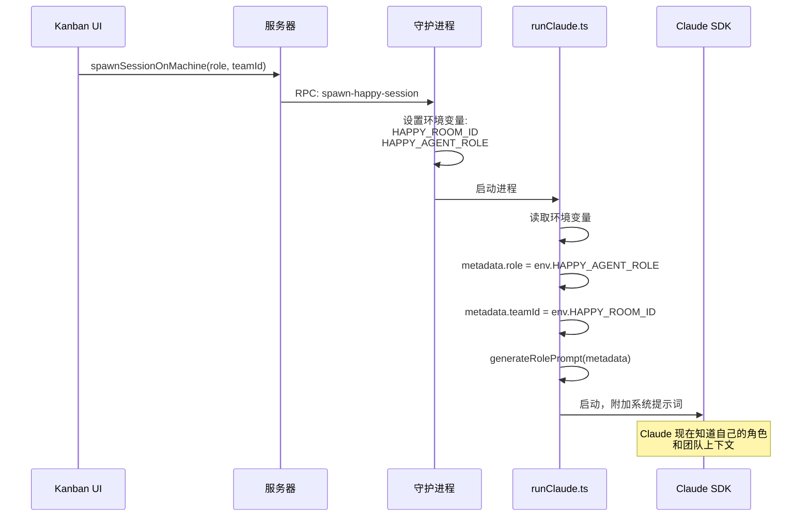
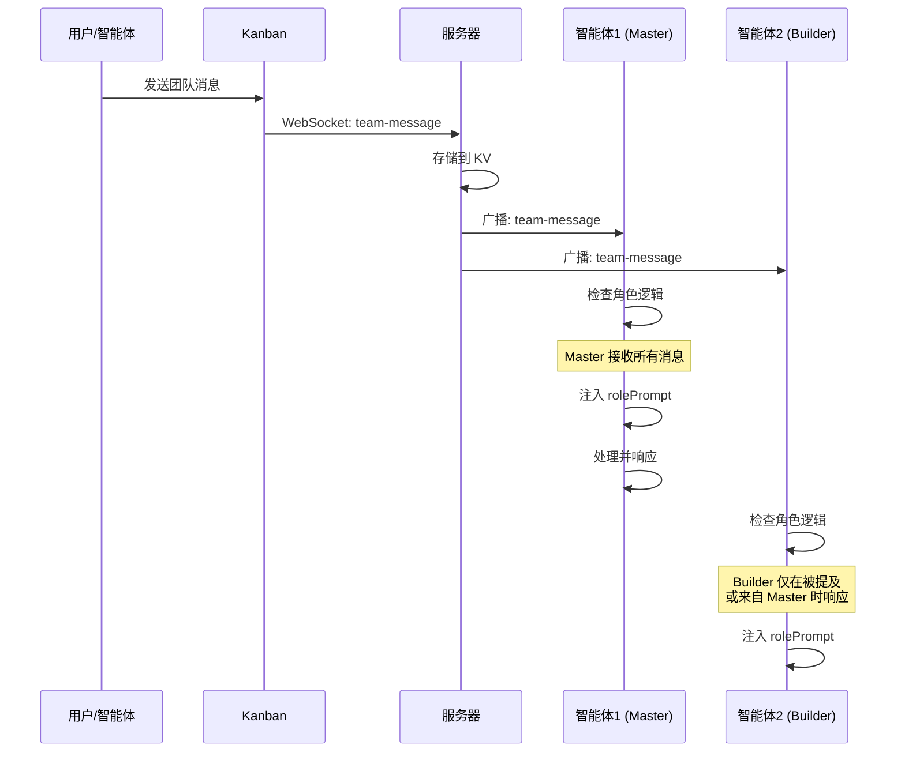
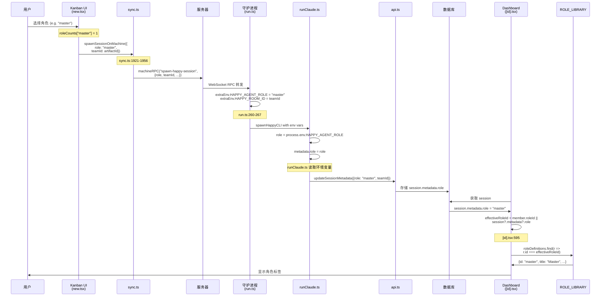

# 团队协作架构

本文档描述了多智能体团队协作系统，使多个 Claude 智能体能够协同完成复杂任务。

## 概述

团队协作系统允许用户生成具有不同角色（Master、Architect、Implementer、QA-Engineer、Observer 等）的多个 AI 智能体，它们通过共享的看板和团队聊天进行沟通协调。

## 系统组件

```mermaid
graph TB
    subgraph "Kanban 前端"
        UI[团队 UI - new.tsx]
        SYNC[SyncSession - sync.ts]
        STORE[团队状态存储]
    end

    subgraph "Happy-CLI 客户端"
        DAEMON[守护进程 - run.ts]
        RUN[runClaude.ts]
        ROLES[roles.ts + roles.config.ts]
        MCP[MCP 服务器 - startHappyServer.ts]
        SDK[Claude SDK]
    end

    subgraph "Happy-Server 后端"
        API[Session 路由]
        WS[WebSocket 服务器]
        RPCSVC[RPC 服务]
        DB[(数据库)]
    end

    subgraph "共享配置"
        CONFIG[@happy/shared-team-config]
    end

    UI -->|生成请求| SYNC
    SYNC -->|WebSocket RPC| WS
    WS -->|转发| RPCSVC
    RPCSVC -->|spawn-happy-session| DAEMON
    DAEMON -->|环境变量: HAPPY_ROOM_ID, HAPPY_AGENT_ROLE| RUN
    RUN -->|加载| ROLES
    ROLES -->|导入| CONFIG
    RUN -->|注册工具| MCP
    RUN -->|携带角色提示词| SDK
    SDK -->|调用工具| MCP
    MCP -->|团队消息| API
    API -->|广播| WS
    WS -->|更新| SYNC
    SYNC -->|通知| UI
```

## 角色注入流程



## 团队消息流程



## 可用角色

| 角色 | 类别 | 描述 | 访问级别 |
|------|------|------|----------|
| `master` | 协调 | 团队协调者，规划和分配工作 | 只读 |
| `orchestrator` | 协调 | 规划、委派、协调工作流 | 只读 |
| `architect` | 架构 | 做技术决策，审查架构 | 完全访问 |
| `implementer` | 开发 | 实现功能，负责代码执行 | 完全访问 |
| `researcher` | 支持 | 探索代码库，收集信息 | 只读 |
| `qa-engineer` | 质保 | 测试功能，验证质量 | 完全访问 |
| `observer` | 支持 | 审计进度，审查交付物 | 只读 |

## 团队协作 MCP 工具

以下工具可供智能体进行团队协调：

### 任务管理
| 工具 | 描述 |
|------|------|
| `create_task` | 在看板上创建新任务 |
| `update_task` | 更新任务状态、负责人或详情 |
| `list_tasks` | 查看当前任务（按角色过滤） |
| `create_subtask` | 在父任务下创建子任务 |
| `list_subtasks` | 列出任务的子任务 |
| `start_task` | 将任务标记为进行中 |
| `complete_task` | 将任务标记为完成 |

### 通信
| 工具 | 描述 |
|------|------|
| `send_team_message` | 发送消息到团队聊天 |
| `get_team_info` | 获取当前团队状态和成员 |

### 阻塞器
| 工具 | 描述 |
|------|------|
| `report_blocker` | 报告任务上的阻塞问题 |
| `resolve_blocker` | 将阻塞器标记为已解决 |

## 关键文件

### Kanban (前端)
| 文件 | 描述 |
|------|------|
| `sources/sync/sync.ts` | WebSocket 同步和团队消息处理 |
| `sources/app/(app)/teams/[id]/new.tsx` | 团队创建和智能体生成 UI |

### Happy-CLI (客户端)
| 文件 | 描述 |
|------|------|
| `src/daemon/run.ts` | 守护进程，使用角色环境变量生成智能体进程 |
| `src/claude/runClaude.ts` | 主智能体循环，处理角色注入 |
| `src/claude/team/roles.ts` | 角色提示词生成 |
| `src/claude/team/roles.config.ts` | 角色定义导入 |
| `src/claude/utils/startHappyServer.ts` | MCP 工具注册 |

### 共享配置
| 文件 | 描述 |
|------|------|
| `shared/team-config/index.cjs` | 角色定义 (TEAM_ROLE_LIBRARY) |
| `shared/team-config/ROLE_DEFINITIONS.yaml` | 完整角色注册表 |

## 角色提示词结构

当智能体加入团队时，以下内容会附加到系统提示词：

```
[SYSTEM: TEAM CONTEXT]
You are part of a software development team (Team ID: <teamId>).
Your role is: <ROLE_NAME>.

RESPONSIBILITIES:
1. <职责 1>
2. <职责 2>
...

PROTOCOL:
- <协议规则 1>
- <协议规则 2>
...

[NEXT STEP GUIDANCE]
To start, you SHOULD:
1. Call 'list_tasks' to see current state.
2. ...

[END TEAM CONTEXT]
```

## 故障排查

### 智能体不知道自己的角色

**症状**: 智能体响应通用，没有特定角色的行为

**原因**: `generateRolePrompt()` 未包含在 `appendSystemPrompt` 中

**解决方案**: 确保团队上下文注入和团队消息转发都包含角色提示词（已在 runClaude.ts 第 441-462 行和 571-592 行修复）

### 团队消息未接收

**症状**: 智能体未收到团队聊天消息

**原因**: sync.ts 中的异步 Mutex 导致竞态条件

**解决方案**: 使用同步订阅处理（JS 中 Map/Set 操作不需要 Mutex）

### 在 DEFAULT_ROLES 中找不到角色

**症状**: `generateRolePrompt` 返回空字符串

**原因**: 角色 ID 不在 TEAM_ROLE_LIBRARY 中

**解决方案**: 将角色定义添加到 `shared/team-config/index.cjs`

## 架构决策

### 1. 使用环境变量传递角色
角色和 teamId 通过环境变量（`HAPPY_AGENT_ROLE`、`HAPPY_ROOM_ID`）传递，确保进程启动时立即可用。

### 2. 同步订阅处理
JavaScript 的单线程特性意味着 Map/Set 操作是原子的。使用异步 Mutex 处理订阅会导致竞态条件。

### 3. 基于角色的工具限制
不同角色有不同的 `disallowedTools`，以强制执行职责分离（例如，只读角色不能编辑文件）。

### 4. 共享配置包
角色定义通过 `@happy/shared-team-config` 本地包在 kanban、happy-cli 和 happy-server 之间共享。

## 角色完整数据流

角色信息从用户选择到 Dashboard 显示的完整流程：



### 数据流关键节点

| 阶段 | 文件 | 行号 | 数据格式 |
|------|------|------|----------|
| 1. 用户选择 | `new.tsx` | 302 | `roleCounts["master"] = 1` |
| 2. Spawn 参数 | `new.tsx` | 597 | `role: roleId` |
| 3. RPC 调用 | `sync.ts` | 1933 | `{role: "master", teamId: "..."}` |
| 4. 环境变量 | `run.ts` | 265 | `HAPPY_AGENT_ROLE=master` |
| 5. 元数据设置 | `runClaude.ts` | - | `metadata.role = env.HAPPY_AGENT_ROLE` |
| 6. 服务器存储 | API | - | `session.metadata.role = "master"` |
| 7. Dashboard 读取 | `[id].tsx` | 595 | `effectiveRoleId = session?.metadata?.role` |
| 8. 角色解析 | `[id].tsx` | 597-600 | `roleDefinitions.find(...)` |

### 角色定义来源

```mermaid
graph TB
    subgraph "共享配置包"
        YAML[ROLE_DEFINITIONS.yaml] --> INDEX[index.cjs]
        INDEX --> LIB[TEAM_ROLE_LIBRARY]
    end

    subgraph "Kanban"
        LIB --> I18N[i18n-loader.ts]
        I18N --> LOCALIZED[getLocalizedTeamRoles]
        LOCALIZED --> NEWUI[new.tsx: ROLE_LIBRARY]
        LOCALIZED --> DASHUI[[id].tsx: roleDefinitions]
    end

    subgraph "Happy-CLI"
        LIB --> CONFIG[roles.config.ts]
        CONFIG --> ROLES[roles.ts]
        ROLES --> PROMPT[generateRolePrompt]
    end
```

## 数据流总结

```mermaid
flowchart LR
    subgraph 用户操作
        A[选择角色] --> B[点击生成]
    end

    subgraph 前端处理
        B --> C[spawnSessionOnMachine]
        C --> D[WebSocket RPC]
    end

    subgraph 后端处理
        D --> E[转发到守护进程]
    end

    subgraph CLI处理
        E --> F[设置环境变量]
        F --> G[启动 Claude]
        G --> H[生成角色提示词]
        H --> I[注入系统提示]
    end

    subgraph 智能体运行
        I --> J[Claude 知道角色]
        J --> K[使用 MCP 工具]
        K --> L[团队协作]
    end

    subgraph Dashboard 显示
        L --> M[session.metadata.role]
        M --> N[roleDefinitions.find]
        N --> O[显示角色标签]
    end
```


