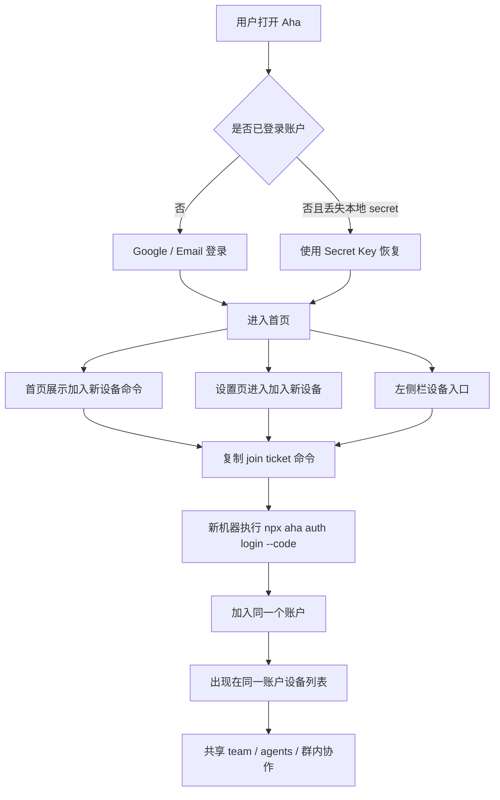

# 账户与设备接入旅程

适用分支：`online-v2-fix`

## 目标

用户心智应当非常简单：

- 同一个 Google 账户，对应同一个 Aha 账户
- 登录后，用户只需要复制一条命令，就能把另一台机器接入当前账户
- 接入后的机器，应该自动出现在同一个账户下，参与同一个团队、同一套协作网络
- `Restore Key` 只用于灾难恢复，不应成为日常“加设备”的主路径

## 四个核心对象

- `Google / Supabase 身份`：负责“你是谁”
- `contentSecretKey / restore key`：负责“这个账户真正的根身份”
- `join ticket`：负责“把一台新机器加入当前账户”的一次性入场券
- `Account.publicKey`：负责“具体某台设备 / 某次 CLI 身份”的公钥标识

关键点：

- 现在服务端持久化的是账户绑定关系，不是浏览器里的私钥本体
- 所以 “Google 登录成功” 不等于 “服务端自动把旧 secret 发回新设备”
- 当前推荐路径是：已登录设备生成 `join ticket`，新机器执行一条命令接入

## 推荐用户旅程

### 1. 首次创建账户

1. 用户在 Web / Kanban 中点击 Google 登录
2. 前端创建或复用当前设备的 secret
3. 服务端建立 `Supabase user -> account/publicKey` 绑定
4. 用户进入首页
5. 首页直接展示“加入新设备”命令

### 2. 已有账户，新增一台机器

1. 用户在任意已登录设备打开“加入新设备”
2. 系统生成一次性 `join ticket`
3. 用户复制命令并在新机器执行：

```bash
npm i aha-agi && npx aha auth login --code <join-ticket>
```

4. 新机器用该 ticket 加入同一个账户
5. 新机器出现在设备列表，加入同一套 team / agent 协作体系

这是默认主路径。

### 3. 原机器还在，但新设备误走了 Google 登录

1. 新设备单独走 Google 登录
2. 如果没有旧 secret，同机会生成一个新的本地 secret
3. 这时它不一定能自动拿回原账户的根身份
4. 正确做法仍然是回到已登录设备，使用“加入新设备”命令接入

这不是推荐路径。

### 4. 所有设备都丢了，只剩备份码

1. 用户在登录页选择“使用 Secret Key 恢复”
2. 输入 `Restore Key`
3. 客户端恢复同一个账户 secret
4. 之前挂在该账户下的机器会重新识别到同一根身份

这是灾难恢复路径，不是日常加设备路径。

## 当前信息架构

### 未登录态

- 只强调：
  - `Google 登录`
  - `Email 登录`
  - `使用 Secret Key 恢复`
- 不再把“链接设备”和“恢复账户”混成一个按钮

### 已登录态

- 首页直接展示“加入新设备”命令
- 设置页入口统一改为“加入新设备”
- 桌面左侧栏新增一级入口：`设备`
- `/restore` 页面作为标准“加入新设备”页面，里面再提供：
  - 一键复制命令
  - 扫码接入
  - 手动输入链接
  - Secret Key 恢复

## Mermaid



## 本次 `online-v2-fix` 已落地内容

- 首页“加入新设备”卡片优先复制 `join ticket` 命令
- 设置页与账户页入口统一改名为“加入新设备”
- `/restore` 页面标题与弹窗统一改成“加入新设备”
- 登录页未登录按钮改成“使用 Secret Key 恢复”
- 桌面左栏新增“设备”一级入口

## 仍然存在的实现边界

- 当前系统还不是“任意新机器只靠 Google 登录就自动拿回旧 secret”
- 也就是说，Google 目前更像身份认证入口，不是完整的 server-side secret recovery
- 如果未来要实现“同一 Google 在任意新机器自动恢复同一账户根身份”，需要服务端托管或封装可恢复的账户主密钥体系

## 结论

现在的产品主叙事应该是：

- `Google 登录` 用来进入账户
- `加入新设备` 用来扩展到账户下的更多机器
- `Restore Key` 用来兜底恢复

不要再把这三件事混成一个入口。
