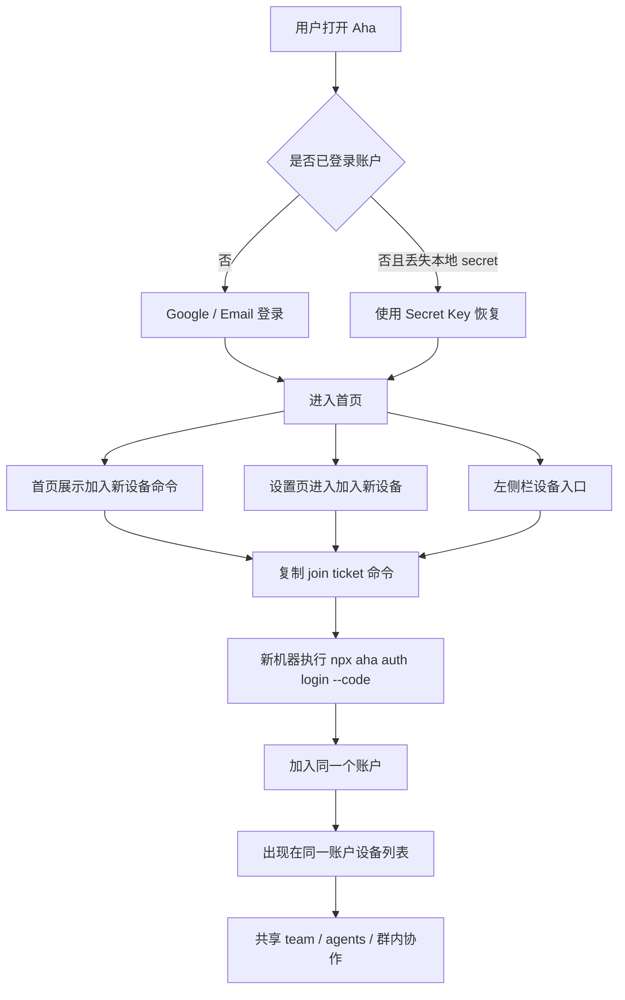

# 账户与设备接入旅程

适用分支：`online-v2-fix`

## 目标

用户心智应当非常简单：

- 同一个 Google 账户，对应同一个 Aha 账户
- 登录后，用户只需要复制一条命令，就能把另一台机器接入当前账户
- 接入后的机器，应该自动出现在同一个账户下，参与同一个团队、同一套协作网络
- `Restore Key` 只用于灾难恢复，不应成为日常“加设备”的主路径

## 四个核心对象

- `Google / Supabase 身份`：负责“你是谁”
- `contentSecretKey / restore key`：负责“这个账户真正的根身份”
- `Account.publicKey`：负责“这个账户的唯一根身份公钥”
- `machineId + machine metadata`：负责“这个账户下的某一台具体机器”
- `join ticket`：负责“把 canonical secret 一次性发给一台新机器”的入场券

关键点：

- `Account.publicKey` 不是设备公钥，也不是某一次 CLI 登录态
- 同一个账户下可以有很多台机器，但只能有一个 canonical `contentSecretKey`
- 服务端现在已经具备加密托管 canonical secret 的能力
- 所以 “Google 登录成功” 的目标不应只是鉴权成功，而应是自动回到同一个 canonical 账户

## 推荐用户旅程

### 1. 首次创建账户

1. 用户在 Web / Kanban 中点击 Google 登录
2. 前端创建或复用当前设备的 secret
3. 服务端建立 `Supabase user -> account/publicKey` 绑定
4. 用户进入首页
5. 首页直接展示“加入新设备”命令

### 2. 已有账户，新增一台机器

1. 用户在一台已登录设备打开“加入新设备”
2. 系统生成一次性 `join ticket`
3. 用户复制命令并在新机器执行：

```bash
npm i aha-agi && npx aha auth login --code <join-ticket>
```

生产部署如果不在默认 `aha-agi.com`，Kanban 会在复制命令中自动追加服务器固定步骤，先写入 CLI 的 `~/.aha/config.json`，再执行登录命令。部署时通过 public env 指定目标：

```bash
EXPO_PUBLIC_AHA_CLI_SERVER_URL=https://ahaagi.com/api
EXPO_PUBLIC_AHA_CLI_WEBAPP_URL=https://ahaagi.com/webappv3
```

4. 新机器用该 ticket 加入同一个账户
5. 新机器出现在设备列表，加入同一套 team / agent 协作体系

这是最低阻力的“加设备”路径。

### 3. 原机器还在，但新设备误走了 Google 登录

1. 新设备单独走 Google 登录
2. 系统应优先按 `recover-first` 自动拿回该 Google 对应账户的 canonical secret
3. 如果自动恢复尚未就绪，才退回到：
   - 去另一台已登录设备复制 `join ticket` 命令
   - 或输入 `Restore Key`

这条链路的目标是：

- 同一个 Google，在新浏览器 / 新机器上应尽可能直接回到同一个账户
- `join ticket` 是加设备捷径，不是替代 Google 身份本身

### 4. 所有设备都丢了，只剩备份码

1. 用户在登录页选择“使用 Secret Key 恢复”
2. 输入 `Restore Key`
3. 客户端恢复同一个账户 secret
4. 之前挂在该账户下的机器会重新识别到同一根身份

这是灾难恢复路径，不是日常加设备路径。

## 当前信息架构

### 未登录态

- 只强调：
  - `Google 登录`
  - `Email 登录`
  - `使用 Secret Key 恢复`
- 不再把“链接设备”和“恢复账户”混成一个按钮

### 强制恢复态

当用户已经用某个 Google 账号登录成功，但当前设备缺少这个账户的原始 secret 时，登录页不再继续展示普通 Google 登录按钮，而是明确分成四条动作：

- `恢复此账户`
- `复制恢复命令`
- `我有另一台已登录设备`
- `切换 Google 账号`

这里的设计意图是：

- 不允许用户在同一个页面里继续误点 Google 登录，造成“为什么又进不去”的循环
- 给“我还有老设备”和“我登错 Google 了”这两个高频分支明确出口
- 把 `Restore Key` 保持为恢复路径，而不是继续和“新增设备”混在一起

这个状态真正表达的是：

- 已确认这是你的 Google 身份
- 但当前设备还没拿到这个账户的 canonical secret
- 所以现在卡住的不是登录，而是账户恢复

### 已登录态

- 首页直接展示“加入新设备”命令
- 设置页入口统一改为“加入新设备”
- 桌面左侧栏新增一级入口：`设备`
- `/restore` 页面作为标准“加入新设备”页面，里面再提供：
  - 一键复制命令
  - 扫码接入
  - 手动输入链接
  - Secret Key 恢复

## Mermaid



## 本次 `online-v2-fix` 已落地内容

- 首页“加入新设备”卡片优先复制 `join ticket` 命令
- 设置页与账户页入口统一改名为“加入新设备”
- `/restore` 页面标题与弹窗统一改成“加入新设备”
- 登录页未登录按钮改成“使用 Secret Key 恢复”
- 登录页强制恢复态补齐“复制恢复命令 / 我有另一台已登录设备 / 切换 Google 账号”
- 桌面左栏新增“设备”一级入口

## 经验教训

- 绝不能在 Google 重登时覆盖 `Account.publicKey`。它是账户根身份，不是可随手替换的设备公钥。
- Web 端把 secret 保存在 `localStorage` 不是偶然实现，而是为了保证同浏览器重登时 restore key 稳定。
- `Restore Key` 不能再被当成“默认加设备命令”。它是灾难恢复，不是日常扩容。
- `join ticket` 解决的是“从已登录设备复制一条命令接入新机器”，不是“Google 自动恢复账户”本身。
- CLI 上的 `restore` / `reconnect` / `join` 成功后，必须顺手把 recovery material 补回服务端，否则会出现“CLI 已经好了，但 Web 还是卡 Restore Key”。
- 对用户来说，群聊、teams、machines 连续性比“某个局部登录动作成功”更重要；只要账户根身份漂移，后续协作一定出问题。

## 仍然存在的实现边界

- 服务端 recovery 体系已经存在，但仍依赖 canonical secret 曾被正确 bootstrap 到服务端
- 历史账户如果没有有效的 recovery material，仍可能在新浏览器掉进 `Restore Key`
- 所以当前真正的收尾重点是：
  - 保证所有成功恢复过的客户端都会反向补齐 recovery material
  - 审计并修复历史账户的 recovery readiness

## 结论

现在的产品主叙事应该是：

- `Google 登录` 是主入口，目标是自动回到同一个 canonical 账户
- `加入新设备` 是已登录设备向新机器复制一条命令的捷径
- `Restore Key` 是灾难恢复兜底

不要再把这三件事混成一个入口。
