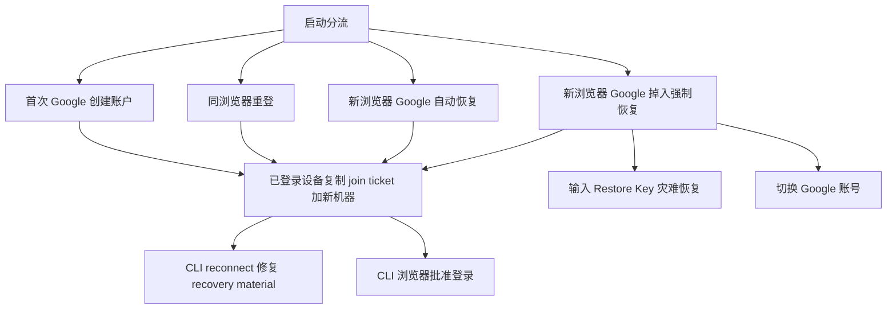

# 认证用户旅程走查

适用分支：`online-v2-fix`

本文不是产品愿景文档，而是一份按当前代码真实行为整理的走查清单。

目标只有两个：

- 按真实代码把用户旅程拆成可逐条验证的路径
- 把每条路径绑定到关键代码文件和行号，便于排查断点

---

## 走查总图



---

## 统一走查结构

每条旅程都按下面 6 个问题检查：

1. 入口条件是什么
2. 用户做了什么动作
3. 客户端先走哪条代码
4. 服务端在哪个分支决定结果
5. 用户最终看到什么
6. 当前最容易断在哪

---

## J0 启动分流

### 入口条件

- Web / Kanban 启动

### 用户动作

- 打开页面

### 客户端关键代码

- `sources/app/_layout.tsx:185`
- `sources/app/_layout.tsx:206`
- `sources/auth/tokenStorage.ts:102`
- `sources/auth/tokenStorage.ts:91`
- `sources/auth/supabaseAuth.ts:214`

### 真实分流

1. 先读本地 `credentials`
2. 如果没有本地 `credentials`，再看 Supabase session
3. 如果拿到了 `access_token`，就调用 `completeSupabaseSession(...)`
4. 如果抛出：
   - `SupabaseRestoreRequiredError`
   - `SupabaseSecretMismatchError`
   - `SupabaseRecoveryNotReadyError`
   就切到强制恢复态

### 用户可见结果

- 直接进入账户
- 或进入普通未登录页
- 或进入强制恢复页

### 走查重点

- 任何 Web 旅程都必须先判断自己是从 `J0` 的哪条分支出来的

---

## J1 新用户首次 Google 登录

### 入口条件

- 干净浏览器
- 没有本地 secret
- 当前 Google 没绑定过 Aha 账户

### 用户动作

- 点击 Google 登录

### 客户端关键代码

- `sources/auth/supabaseAuth.ts:64`
- `sources/app/_layout.tsx:204`
- `sources/auth/supabaseAuth.ts:237`
- `sources/auth/supabaseAuth.ts:251`

### 服务端关键代码

- `sources/app/api/routes/authRoutes.ts:640`
- `sources/app/api/routes/authRoutes.ts:682`
- `sources/app/api/routes/authRoutes.ts:708`
- `sources/app/api/routes/authRoutes.ts:732`

### 真实路径

1. Web 发起 Supabase OAuth
2. 回跳后 `_layout` 拿到 session
3. `completeSupabaseSession` 先尝试 `/v1/auth/supabase/recover`
4. 因为 `ACCOUNT_NOT_FOUND`，转去生成新 secret
5. 用新 secret 调 `/v1/auth/supabase/exchange`
6. server 创建新账户并写入 recovery material

### 用户可见结果

- 直接进入新账户
- 后续 restore key 固定

### 走查重点

- 首次创建账户不应该出现 restore 输入框

---

## J2 同一浏览器退出后重登

### 入口条件

- 浏览器之前登录过
- 用户执行过正常 logout

### 用户动作

- 退出后再次用同一个 Google 登录

### 客户端关键代码

- `sources/auth/AuthContext.tsx:116`
- `sources/auth/AuthContext.tsx:122`
- `sources/auth/tokenStorage.ts:174`
- `sources/auth/tokenStorage.ts:95`
- `sources/app/_layout.tsx:206`

### 真实路径

1. `logout()` 走 `clearToken()`，不会删除持久 secret
2. 下一次 `_layout` 通过 `getStoredSecretForReauth()` 取回旧 secret
3. `completeSupabaseSession` 优先用这个 secret 走 `/supabase/exchange`
4. 服务端验证该 secret 对应的 `Account.publicKey`

### 用户可见结果

- 直接回到原账户
- restore key 不变化

### 走查重点

- 如果这条路径里 restore key 变了，先查是不是有人误用了 `removeCredentials()`

---

## J3 新浏览器 / 新机器，同一个 Google，自动恢复成功

### 入口条件

- 本地没有 secret
- server 上已有该 Google 对应账户
- `AccountRecoveryMaterial` 有效

### 用户动作

- 在新浏览器点击 Google 登录

### 客户端关键代码

- `sources/auth/supabaseAuth.ts:180`
- `sources/auth/supabaseAuth.ts:237`

### 服务端关键代码

- `sources/app/api/routes/authRoutes.ts:753`
- `sources/app/api/routes/authRoutes.ts:786`
- `sources/app/api/routes/authRoutes.ts:797`
- `sources/app/api/routes/authRoutes.ts:805`
- `sources/app/api/routes/authRoutes.ts:820`

### 真实路径

1. `completeSupabaseSession` 发现没有本地 secret
2. 直接调用 `/v1/auth/supabase/recover`
3. server 按 `supabaseUserId` 找到账户
4. server 从 `AccountRecoveryMaterial` 取出 canonical secret
5. secret 加密返回给新设备
6. 新设备保存 secret 并进入原账户

### 用户可见结果

- 不需要输入 Restore Key
- 直接进入同一个账户

### 走查重点

- 这是“同一个 Google = 同一个账户”的主路径

---

## J4 新浏览器 / 新机器，同一个 Google，但掉进强制恢复

### 入口条件

- 本地没有 secret
- 账户存在，但 recovery 没准备好
- 或当前设备拿着错误 secret

### 用户动作

- 点击 Google 登录

### 客户端关键代码

- `sources/app/_layout.tsx:209`
- `sources/app/(app)/index.tsx:649`
- `sources/app/(app)/index.tsx:667`
- `sources/app/(app)/index.tsx:695`
- `sources/app/(app)/index.tsx:711`

### 服务端关键代码

- `sources/app/api/routes/authRoutes.ts:674`
- `sources/app/api/routes/authRoutes.ts:797`

### 真实分支

- `secret-proof-mismatch`
- `RECOVERY_NOT_READY`

前端会统一进入 restore flow。

### 用户可见结果

- 输入 Restore Key
- 查看“我有另一台已登录设备”
- 切换 Google 账号

### 走查重点

- 这里卡住不代表 Google 登录失败
- 真正失败的是“当前设备没有拿到 canonical secret”

---

## J5 已登录设备复制命令，加一台新机器

### 入口条件

- 当前已有一台已登录设备
- 该账户 recovery material 已可用

### 用户动作

- 打开首页 / 设置 / 加入新设备页
- 复制一条命令到另一台机器执行

### 客户端关键代码

- `sources/auth/accountJoinTicket.ts:4`
- `sources/auth/cliCommands.ts:3`
- `sources/components/layout/HomeMainPanel.tsx:662`
- `sources/components/layout/HomeMainPanel.tsx:723`

### 服务端关键代码

- `sources/app/api/routes/authRoutes.ts:342`
- `sources/app/api/routes/authRoutes.ts:369`
- `sources/app/api/routes/authRoutes.ts:374`

### CLI 关键代码

- `src/commands/auth.ts:310`
- `src/api/accountJoin.ts:29`

### 真实路径

1. 已登录设备向 `/v1/account/join-ticket` 请求 ticket
2. Web 把 ticket 组装成：

```bash
npm i aha-agi && npx aha auth login --code <aha_join_...>
```

3. 新机器识别出这是 join ticket
4. CLI 调 `/v1/auth/account/join`
5. server 返回 canonical secret
6. 新机器写入本地并加入同一个账户

### 用户可见结果

- 新机器进入同一个账户
- 出现在 machines 列表

### 走查重点

- Home 上优先出现的应该是 `aha_join_...`
- 不是 restore 命令

---

## J6 所有设备都没了，只剩 Restore Key

### 入口条件

- 没有任何旧设备可以生成 join ticket
- 但用户还有 restore key

### 用户动作

- 在 Web 输入 Restore Key
- 或在 CLI 执行 `aha auth restore --code ...`

### Web 客户端关键代码

- `sources/app/(app)/index.tsx:512`

### CLI 关键代码

- `src/commands/auth.ts:175`
- `src/api/auth.ts:21`

### 服务端关键代码

- `/v1/auth`
- `/v1/auth/reconnect`

### 真实路径

1. 用户输入的 restore key 被解析成 32-byte secret
2. 用这把 secret 去换 token
3. 成功后恢复到账户
4. 现在 CLI / Web 都应顺手 bootstrap recovery material

### 用户可见结果

- 回到原账户

### 走查重点

- 这是灾难恢复
- 不是默认加设备路径

---

## J7 CLI reconnect

### 入口条件

- CLI 本地已经有凭据
- 只需要换新 token

### 用户动作

- 执行 `aha auth reconnect`

### CLI 关键代码

- `src/commands/auth.ts:236`
- `src/auth/reconnect.ts:41`
- `src/auth/recoveryBootstrap.ts:18`

### 服务端关键代码

- `/v1/auth/reconnect`
- `/v1/account/recovery-material`

### 真实路径

1. 读本地 credentials
2. 用 secret 调 `/v1/auth/reconnect`
3. 刷新 token
4. 再自动调用 `/v1/account/recovery-material`

### 用户可见结果

- CLI reconnect 成功
- server recovery readiness 被修好

### 走查重点

- 这条是当前“修复后最关键的补洞链路”
- 用来解决“CLI 已经恢复成功，但新浏览器还卡 restore”

---

## J8 CLI 浏览器批准登录

### 入口条件

- 本地 CLI 没有凭据
- 用户执行 `aha auth login`

### 用户动作

- 运行命令
- 浏览器批准

### CLI 关键代码

- `src/ui/auth.ts:28`
- `src/ui/auth.ts:80`
- `src/ui/auth.ts:114`
- `src/ui/auth.ts:155`
- `src/commands/auth.ts:389`

### 服务端关键代码

- `/v1/auth/request`

### 真实路径

1. CLI 先注册 terminal auth request
2. 打开浏览器 URL
3. 等待网页把加密 response 回传
4. 如果拿到的是 V2 payload，就写成 `contentSecretKey`
5. 成功后自动 bootstrap recovery material

### 用户可见结果

- CLI 进入已认证状态
- daemon 启动

### 走查重点

- 看返回的是 legacy 32-byte，还是 V2 `contentSecretKey`

---

## J9 切换 Google 账号

### 入口条件

- 当前页面处于强制恢复态
- 用户判断自己登错了 Google

### 用户动作

- 点击“切换 Google 账号”

### 客户端关键代码

- `sources/app/(app)/index.tsx:567`
- `sources/auth/tokenStorage.ts:154`
- `sources/auth/supabaseAuth.ts:276`

### 真实路径

1. 清掉当前本地 credentials
2. 同时清掉持久 secret
3. 调 `signOutSupabase()`
4. reload 页面

### 用户可见结果

- 下次登录不会再复用旧 secret
- 可以切换到另一个 Google 账户

### 走查重点

- 这条和普通 logout 不同
- 它的目的就是故意放弃当前账户根身份缓存

---

## 建议的手工走查顺序

1. 跑 `J1`，确认首次创建账户正常
2. 跑 `J2`，确认同浏览器重登 restore key 不变
3. 跑 `J5`，确认首页复制出来的是 `aha_join_...`
4. 跑 `J7`，确认 CLI reconnect 后可以修复 Web fresh browser 登录
5. 跑 `J3`，确认同一个 Google 在新浏览器自动恢复成功
6. 故意制造一个 `RECOVERY_NOT_READY` 场景跑 `J4`
7. 最后跑 `J9`，确认切换账号行为符合预期

---

## 最关键的 5 个断点

- `sources/app/_layout.tsx:185`
- `sources/auth/supabaseAuth.ts:214`
- `sources/app/api/routes/authRoutes.ts:674`
- `sources/app/api/routes/authRoutes.ts:797`
- `src/commands/auth.ts:248`

只要先盯住这 5 个点，大多数“为什么登录后又卡住”都能很快定位。
